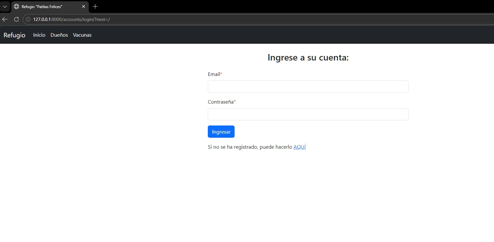
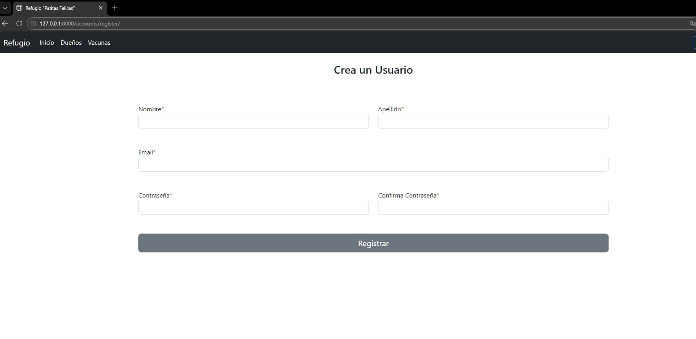
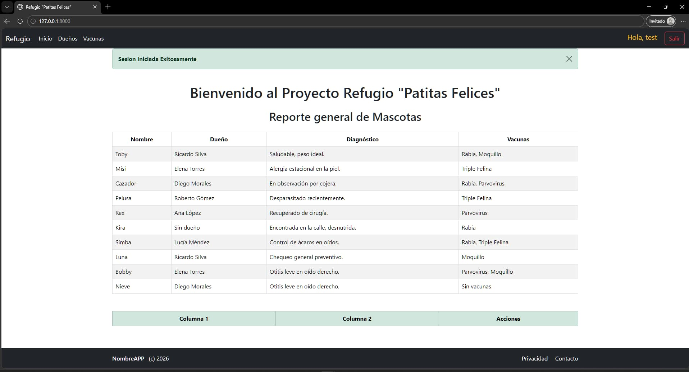
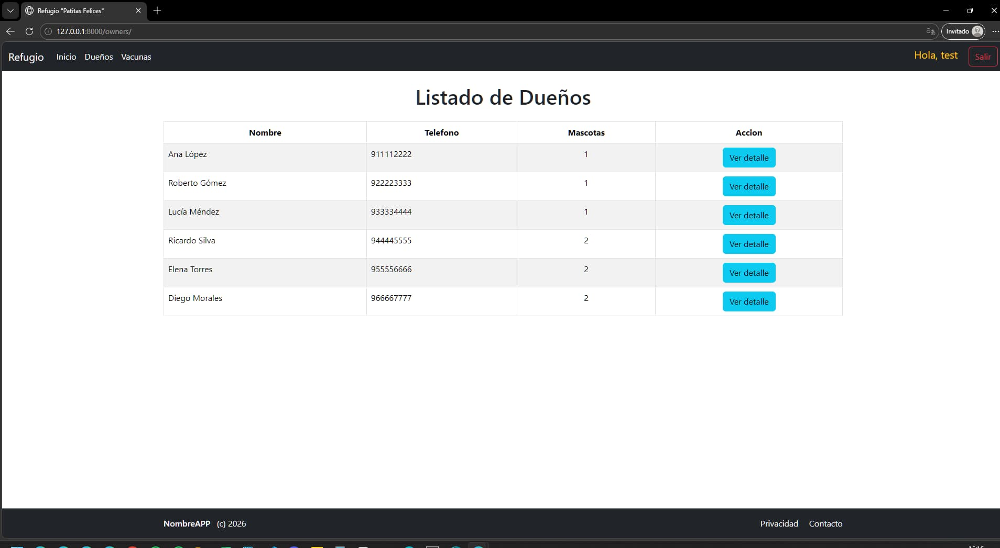
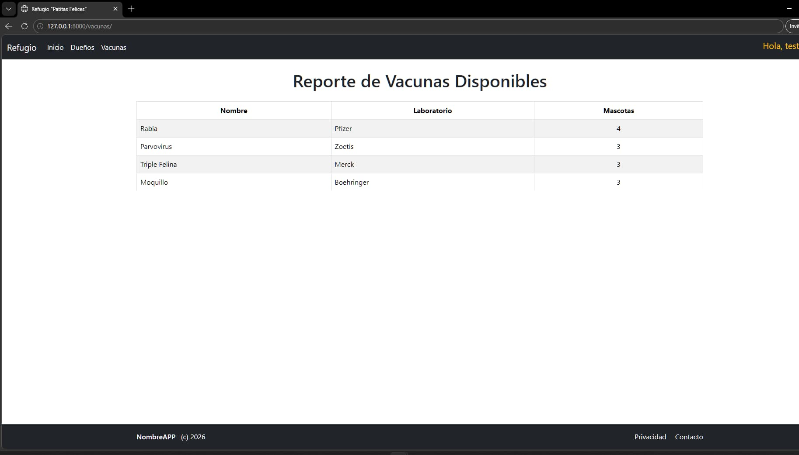
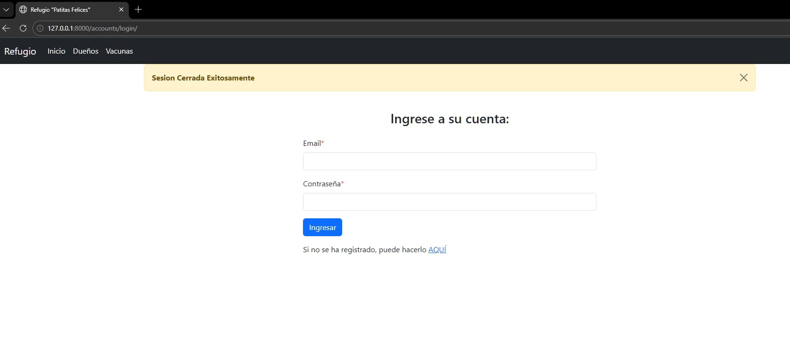

# Refugio "Patitas Felices"

Aplicación web desarrollada en **Django** para administrar información de un refugio: **mascotas**, **dueños**, **vacunas** y **expediente médico**, con **registro/inicio/cierre de sesión**.

## Tecnologías

- Python
- Django
- SQLite (base de datos en desarrollo)
- Bootstrap 5 (CDN)
- Font Awesome (CDN)

## Links disponibles (rutas)

- `/` Inicio (reporte general de mascotas) *(requiere login)*
- `/owners/` Listado de dueños
- `/owners/<id>/` Detalle del dueño y sus mascotas
- `/vacunas/` Reporte de vacunas disponibles
- `/accounts/login/` Inicio de sesión
- `/accounts/register/` Registro de usuario
- `/accounts/logout/` Cierre de sesión
- `/admin/` Administración de Django

## Ejecución local

```bash
python -m venv .venv
.\.venv\Scripts\activate
pip install -r requirements.txt
python manage.py migrate
python manage.py runserver
```

Abrir `http://127.0.0.1:8000/`.

## Capturas de funcionamiento







